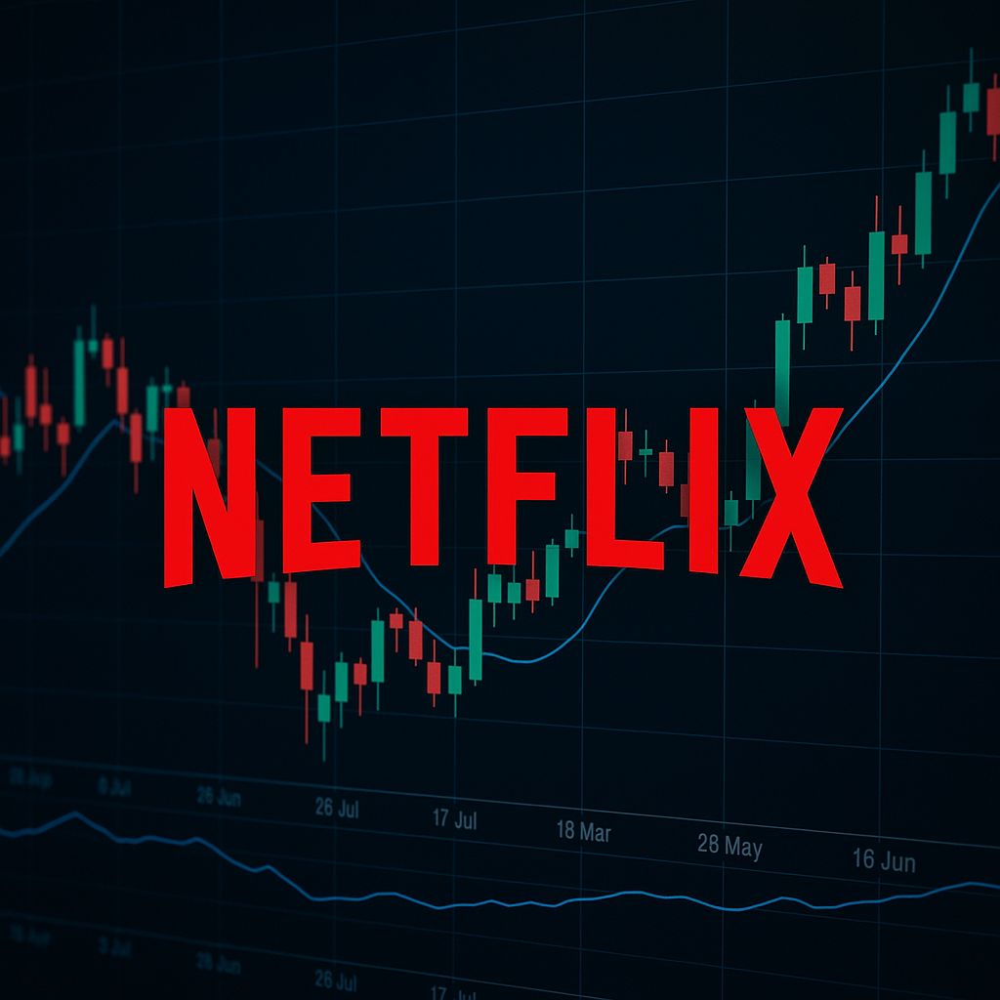
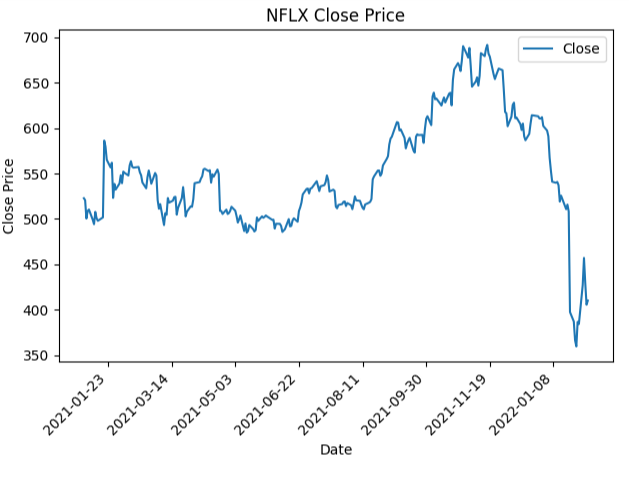
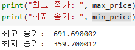
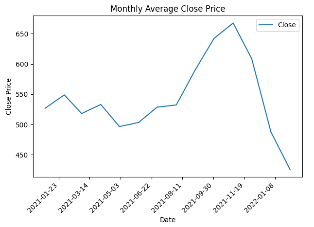
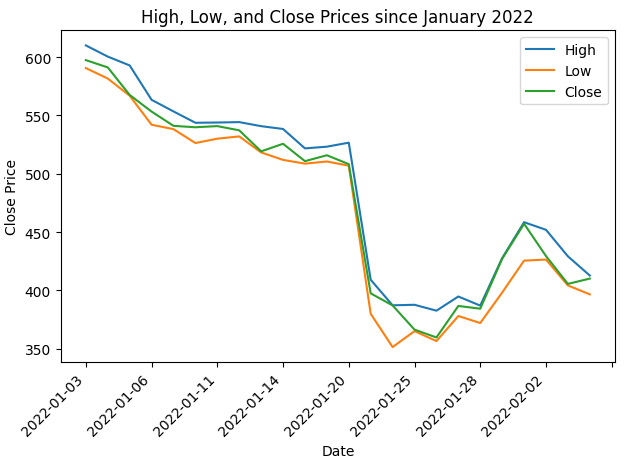

# pjt-02


# 📈 Netflix(NFLX) 주가 분석 프로젝트




** 넷플릭스(NFLX)의 주가 데이터를 바탕으로 시계열 분석 및 시각화를 진행한 프로젝트입니다.  
2021년부터 2022년까지의 데이터를 월별로 집계하고, 고가/저가/종가 등의 주요 지표를 시각적으로 분석하였습니다. **

---

## 📂 사용한 데이터

- **데이터 출처**: Kaggle / Yahoo Finance  
- **파일 형식**: `CSV (NFLX.csv)`  
- **주요 컬럼**:
  - `Date` (날짜)
  - `Open`, `High`, `Low`, `Close` (주가 관련 지표)

---

## 1️⃣ 2021년 이후 종가 시계열 시각화


```python
df_after_2021 = df[df["Date"] >= "2021-01-01"]
plt.plot(df_after_2021['Date'], df_after_2021['Close'], label='Close')
```






✅ 최고 종가: 691.69

✅ 최저 종가: 359.70


## 2️⃣ 월별 평균 종가 시각화
```python
df_after_2021['YearMonth'] = df_after_2021['Date'].dt.to_period('M')
df_monthly_avg = df_after_2021.groupby('YearMonth').mean(numeric_only=True)
```




📌 월별 종가의 평균을 통해 넷플릭스 주가의 장기 추세를 더 명확히 파악할 수 있었습니다.

## 3️⃣ 2022년 이후 고가/저가/종가 비교 시각화
```python
plt.plot(df_after_2022['Date'], df_after_2022['High'], label='High')
plt.plot(df_after_2022['Date'], df_after_2022['Low'],  label='Low')
plt.plot(df_after_2022['Date'], df_after_2022['Close'],label='Close')
```




** 📉 2022년 초 넷플릭스 주가는 급락하며 변동성이 큰 모습을 보였습니다. **


## 💡 느낀 점
- .dt를 사용하려면 날짜를 문자열이 아닌 datetime으로 변환해야 한다는 점을 깨달음

- groupby().mean() 후 to_timestamp()로 다시 시계열 그래프를 그릴 수 있었음

- matplotlib.ticker.MaxNLocator로 x축 간격 조절 → 가독성 크게 향상

## ⚠️ 어려웠던 점
- groupby 후 Period 타입이 바로 시각화에 쓰이기 어려워 to_timestamp() 처리를 필요로 했음

- 날짜 타입 변환을 빼먹어 .dt accessor 오류가 발생했었음

## 🚀 Future Work
📉 이동평균선(MA) 추가해 추세선 분석

📊 거래량(volume) 분석 시각화

🤖 Prophet, ARIMA 등 시계열 예측 모델 적용

💻 Streamlit, Dash로 인터랙티브 웹 대시보드 구현

## 👥 Team

|        | 이름   | 역할               |
|--------|--------|--------------------|
|  | 양준서 | 파이썬 코드 작성    |
|  | 유주성 | 파이썬 코드 작성    |


## 전체 코드
```python
import numpy as np
import pandas as pd
import matplotlib.pyplot as plt
import matplotlib.ticker as ticker

# CSV 파일 경로
csv_path = "archive/NFLX.csv"

# CSV 파일 읽어오기 (첫 번째, 마지막 열 제외)
df = pd.read_csv(csv_path, usecols=range(0, 5))

# DataFrame 출력
df

# 2021년 이후 데이터 필터링
df_after_2021 = df[df["Date"] >= "2021-01-01"].copy()

# 출력하기
df_after_2021

# 그래프 그리기
df_after_2021['Date'] = pd.to_datetime(df_after_2021['Date'], errors='coerce')

# 2. figure와 ax 먼저 생성
fig, ax = plt.subplots()

# 3. ax로 그래프 그리기
ax.plot(df_after_2021['Date'], df_after_2021['Close'], label='Close')

# 4. x축 눈금 개수 제한
ax.xaxis.set_major_locator(ticker.MaxNLocator(nbins=9))

# 5. 기타 설정
plt.xticks(rotation=45, ha='right')
ax.set_title('NFLX Close Price')
ax.set_xlabel('Date')
ax.set_ylabel('Close Price')
ax.legend()

plt.tight_layout()
plt.show()

max_price = max(df_after_2021['Close'])
min_price = min(df_after_2021['Close'])

print("최고 종가: ", max_price)
print("최저 종가: ", min_price)

df_after_2021['YearMonth'] = df_after_2021['Date'].dt.to_period('M')


df_after_2021
df_after_group_2021 = df_after_2021.groupby('YearMonth', as_index=False).mean(numeric_only=True)
df_after_group_2021
df_after_group_2021['YearMonth']
df_after_group_2021['YearMonth'] = df_after_group_2021['YearMonth'].dt.to_timestamp()
df_after_group_2021


# 1. figure, ax 생성
fig, ax = plt.subplots()

# 2. plot (ax를 통해)
ax.plot(df_after_group_2021['YearMonth'], df_after_group_2021['Close'], label='Close')

# 3. x축 눈금 수 제한
ax.xaxis.set_major_locator(ticker.MaxNLocator(nbins=10))

# 4. 레이블 회전
plt.setp(ax.get_xticklabels(), rotation=45, ha='right')

# 5. 제목, 레이블, 범례 설정
ax.set_title('Monthly Average Close Price')
ax.set_xlabel('Date')
ax.set_ylabel('Close Price')
ax.legend()

# 6. 여백 자동 조정 + 출력
plt.tight_layout()
plt.show()

# 2022년 이후 데이터 필터링
df_after_2022 = df[df["Date"] >= "2022-01-01"]

# 출력하기
df_after_2022

# 1) figure, ax 생성
fig, ax = plt.subplots()

# 2) ax 기반 plot
ax.plot(df_after_2022['Date'], df_after_2022['High'],  label='High')
ax.plot(df_after_2022['Date'], df_after_2022['Low'],   label='Low')
ax.plot(df_after_2022['Date'], df_after_2022['Close'], label='Close')

# 3) x축 눈금 개수 제한
ax.xaxis.set_major_locator(ticker.MaxNLocator(nbins=10))

# 4) x축 레이블 회전
plt.setp(ax.get_xticklabels(), rotation=45, ha='right')

# 5) 제목, 축 레이블, 범례
ax.set_title('High, Low, and Close Prices since January 2022')
ax.set_xlabel('Date')
ax.set_ylabel('Close Price')
ax.legend()

# 6) 여백 정리 + 출력
plt.tight_layout()
plt.show()
```