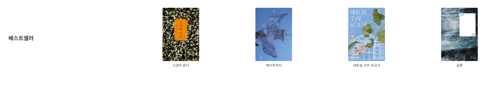
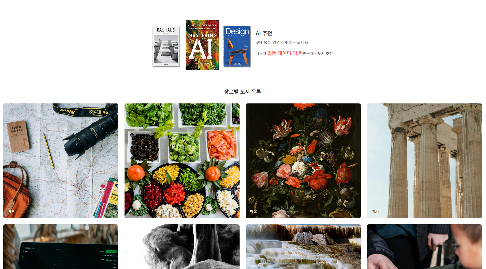
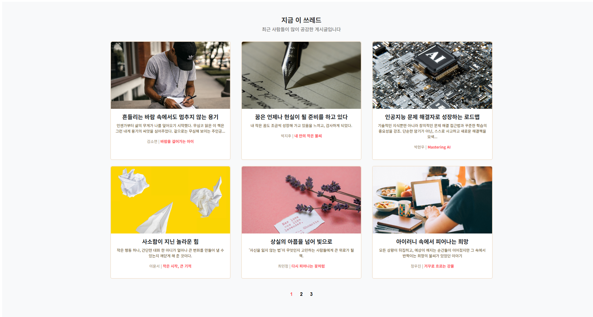

# pjt_03

# ThRead 도서 반응형 웹 사이트 제작 프로젝트

**반응형 웹 페이지를 구성하여 모바일 환경, 데스크탑 환경을 모두 고려하여 도서 웹 사이트를 만든 프로젝트입니다.  
네비게이션 바를 이용한 로그인, 로그 아웃 모달, 베스트셀러 carousel, AI 추천 도서 목록, 쓰레드를 각각 웹 페이지에 추가했습니다.**

## 📂 사용한 언어
  
- **파일 형식**: `html`  

---

## 1️⃣ 네비게이션 바, Hero 이미지, 베스트셀러

- **네비게이션 바, Hero 이미지**

- **베스트셀러 Carousel**

- 4권씩 carousel의 형태로 돌아가며 next 버튼을 누르면 동작한다.
- 버튼을 누르지 않아도 자동으로 돌아간다.
---

## 2️⃣ AI 도서 추천 목록, 장르 리스트

- **AI 추천 도서, 장르 목록**

---

## 3️⃣ 쓰레드

- **쓰레드 화면**

